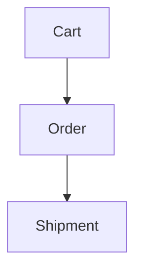
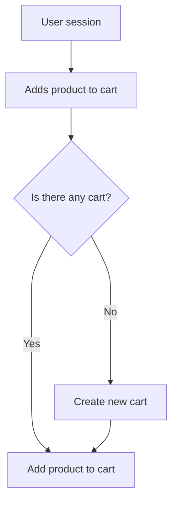
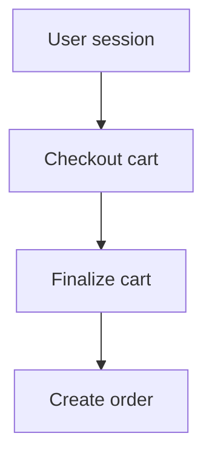
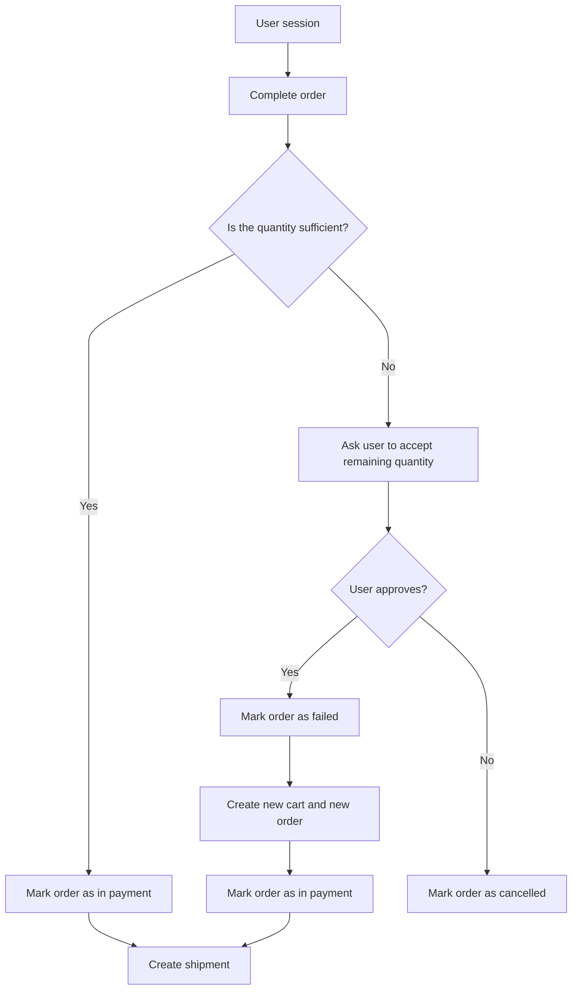

# Cart Evolution
The behaviour of the carts created by users are handled via a *promotion* flow 
defined as follows.

## Cart creation
If there's no carts associated to the current user session marked as *created* 
and the user adds a new product to the cart, then a new cart is created in the 
database; otherwise the product is added to the existing cart.

## Cart checkout
When the user decides to check out the cart, it will be marked as *finalized* 
(no more editable) and an associated order will be created.

## Order completion
When the user decides to complete the order, the availability of the requested 
products quantity is checked via the `sequence` field of the `product_history` 
table. If the quantity is sufficient then the order is marked as *completed* 
and the products quantity are updated, otherwise the user is notified, the order 
is marked as *failed*, if the user approves the notification then a new cart 
is created with the new quantity and the order is marked as *completed* and a 
new shipment for the order is created, otherwise the order is marked as 
*cancelled*.

## Shipment management
When an `order` is completed it will be *promoted* to `shipment` and it can be managed by the seller. Each time the shipment status changes, a notification is 
sent to the user buyer.

The status of the shipment can be:
- *processing*
- *shipped*
- *in delivery*
- *delivered*
